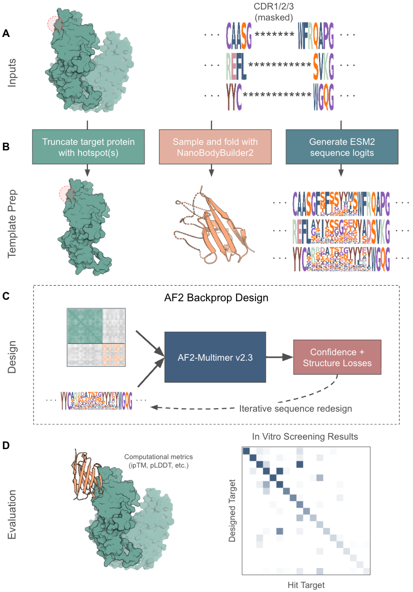

# mber - Manifold Binder Engineering and Refinement

An open-source protein design framework for antibody binder design. mBER enables format specific binder design by leveraging structure templates and sequence conditioning in backprop design through AlphaFold-Multimer.

## Graphical Abstract



## Design Philosophy

We aim to create a flexible, modular, and efficient pipeline for the design of protein binders. Due to the variety of protein design problems, the parameters of these pipelines can be highly varied. To account for this, we aim to create a system that can be easily configured to suit the needs of the user. This is achieved via a series of core modules that can be easily swapped in and out, and a configuration system that allows for easy parameter tuning. These core modules include template preparation, trajectory optimization, and evaluation. These modules are defined in the `src/mber/core/modules` directory.

To avoid the common problem of ballooning config files, we have opted to create a set of protocols which extend the core modules to handle specific design problems. These protocols are stored in the `protocols` directory.

## Architecture

The mber pipeline is built around three key modules:

1. **Template** - Prepares target structures, identifies hotspots, and creates initial templates
2. **Trajectory** - Designs binder sequences using protein folding models and optimization
3. **Evaluation** - Evaluates designed binders using various metrics

Each module is designed to be modular and configurable, with sensible defaults that can be overridden as needed.

## Documentation

- [Protocols Guide](./protocols/README.md) - How to create and use protocols
- [Core Components](./src/mber/core/README.md) - Documentation of core functionality
- [Example Notebooks](./notebooks) - Jupyter notebooks demonstrating usage

## Installation

mber has been tested on modern NVIDIA datacenter GPUs, including A10G, A100, L4, L40S, and H100 GPUs. We recommend using a GPU with at least 32GB of VRAM, although design of VHH against small targets should be possible on GPUs with less than 16GB of VRAM. We run mber in a conda environment, which can be created as follows:

```bash
# Clone the repository
git clone https://github.com/manifoldbio/mber-open.git
cd mber

# Install conda environment
conda env create -f environment.yml
conda activate mber

# Install mber-protocols (contains the VHH binder design protocol)
pip install -e protocols

# Download AlphaFold2 weights
bash download_af_weights.sh
```

## Usage

See the [notebooks](./notebooks) for examples of how to use mber.

## License

MIT License - See the LICENSE file for details.

## Citation

If you use this code in your research, please cite our paper:

[Paper citation to be added]

## Acknowledgements

This project builds on several open-source tools and models:
- [AlphaFold](https://github.com/deepmind/alphafold)
- [ColabDesign](https://github.com/sokrypton/ColabDesign)
- [ESM](https://github.com/facebookresearch/esm)
- [AbLang](https://github.com/oxpig/AbLang)
- [ImmuneBuilder](https://github.com/oxpig/ImmuneBuilder)
